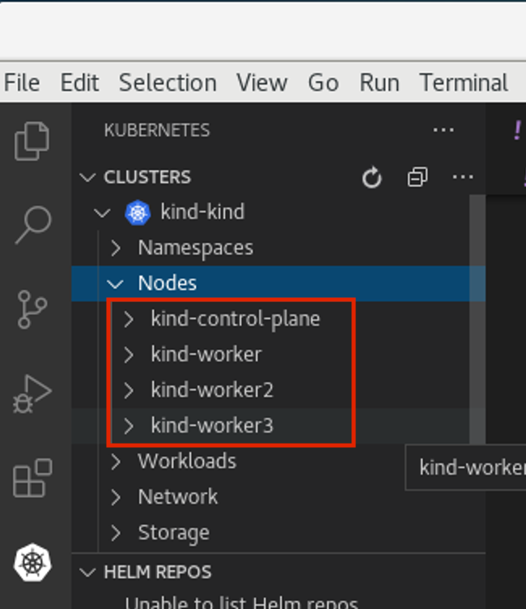

== Kubernetes - Workshop
This is just an intro, which tights to the presentation of Modern Application. During our CEO meeting onsite at VMware in Palo Alto, we will cover a lots of new Modern Ways. As we will present Tanzu, AKO, MAKO, OpenShift etc, we feel a little background on how things work is good for you before you come onsite. 
For this workshop we will leverage kind. +
KIND is a tool for running local Kubernetes clusters using Docker container “nodes”. *KIND Kubernetes in Docker*
KIND was primarily designed for testing Kubernetes itself, but may be used for local development or CI. We also have some testing to run Tanzu +
link:++https://tanzu.vmware.com/developer/guides/gs-tap-on-kind-pt1/++[KIND VMware Beta Site]

We will first build a simple cluster with a specific name. If you omit the flag --name default name will be KIND.
As we get a little more familiar with kind cli, keep in mind that the other tool we could have selected was minikube, however, KIND is newer and allows you to run a small kubernetes cluster for testing and learning purposes.

NOTE: This will not cover AKO, MAKO, Tanzu but just K8s!
====
Shotcut your typing
----
echo  "alias k=kubectl" >>~/.bashrc
echo "kubectl completion bash|sed s/kubectl/k/g" >>.bashrc
. .bashrc
----

Understand how to use help with kubectl. Each main subcommand has a subset of help. The main will be kubectl -h or kubectl --help. Of course, this workshop is not going through each of the commands, that's something you can explore on your own. We will, however cover many of them.

Verbose and debug mode. Depending on what you are looking for, kubectl can help to display the API calls. Test it by starting with level 6 and then by checking the level 7, and debug 8 to see the different outputs. +

You can also try debug level 9 for more verbosity and also level 10 if you really want to see all call, even it's not listed on this page and it will have a lots of data!
link:++https://kubernetes.io/docs/reference/kubectl/cheatsheet/++[Kubernetes CheatSheet] +

IMPORTANT: I assume you have set the alias above, as this workshop will use the short handed command. 

----
k get -v6 pods
----

Show Merged kubeconfig settings.
----
k config view
----

Use multiple kubeconfig files at the same time and view merged config
----
KUBECONFIG=~/.kube/config:~/.kube/kubconfig2
----

----
k config view
----

Display list of contexts
----
k config get-contexts
----

Display the current-context
----
k config current-context
----

Set the default context to my-cluster-name, the name can be showed with the command above.
----
k config use-context <<cluster-name>>
k config set-context kind-remo
k config -h <to get some additional help>
----

EXAMPLE:  (in my case I have two running, KIND and Minikube, and it shows you which is the default config)
----
k config get-contexts
CURRENT   NAME        CLUSTER     AUTHINFO    NAMESPACE
*         kind-kind   kind-kind   kind-kind
          minikube    minikube    minikube    default

----

Add a new user to your kubeconf that supports basic auth. This command is very useful and many people leverage this on the fly to do testing. 
----
k config set-credentials kubeuser/foo.kubernetes.com --username=kubeuser --password=kubepassword
----

Permanently save the namespace for all subsequent kubectl commands in that context.
----
k config set-context --current --namespace=ciao
----

Set a context utilizing a specific username and namespace.
----
k config set-context gce --user=cluster-admin --namespace=ciao \
  && k config use-context gce
----

This unsets the config for the user ciao
k config unset users.ciao

====

== Single Cluster

First let's evaluate kind's help
----
kind --help
kind creates and manages local Kubernetes clusters using Docker container 'nodes'

Usage:
  kind [command]

Available Commands:
  build       Build one of [node-image]
  completion  Output shell completion code for the specified shell (bash, zsh or fish)
  create      Creates one of [cluster]
  delete      Deletes one of [cluster]
  export      Exports one of [kubeconfig, logs]
  get         Gets one of [clusters, nodes, kubeconfig]
  help        Help about any command
  load        Loads images into nodes
  version     Prints the kind CLI version

Flags:
  -h, --help              help for kind
      --loglevel string   DEPRECATED: see -v instead
  -q, --quiet             silence all stderr output
  -v, --verbosity int32   info log verbosity
      --version           version for kind

Use "kind [command] --help" for more information about a command.
----

----
kind create cluster --name workshop
----

OUTPUT:
----
➜ kind create cluster --name workshop
Creating cluster "workshop" ...
 ✓ Ensuring node image (kindest/node:v1.20.2) 🖼
 ✓ Preparing nodes 📦
 ✓ Writing configuration 📜
 ✓ Starting control-plane 🕹️
 ✓ Installing CNI 🔌
 ✓ Installing StorageClass 💾
Set kubectl context to "kind-workshop"
You can now use your cluster with:

k cluster-info --context kind-workshop

Have a nice day! 👋
----

Using kind command to verify we have a cluster
----
➜ kind get clusters
----

OUTPUT:
----
➜ kind get clusters
workshop
----

Check nodes
----
➜ k get nodes
----

OUTPUT:  We can see the workshop name for the control plane.
----
➜ k get nodes
NAME                     STATUS   ROLES                  AGE   VERSION
workshop-control-plane   Ready    control-plane,master   11m   v1.20.2
----

We will use the describe subcommand to see the details of the node.
----
➜ k describe no <<your node name>>
----

Example:
----
➜ k describe no workshop-control-plane
----

NOTE: the option no is short for nodes.

OUTPUT:
----
➜ k describe no workshop-control-plane
Name:               workshop-control-plane
Roles:              control-plane,master
Labels:             beta.kubernetes.io/arch=amd64
                    beta.kubernetes.io/os=linux
                    kubernetes.io/arch=amd64
                    kubernetes.io/hostname=workshop-control-plane
                    kubernetes.io/os=linux
                    node-role.kubernetes.io/control-plane=
                    node-role.kubernetes.io/master=
Annotations:        kubeadm.alpha.kubernetes.io/cri-socket: unix:///run/containerd/containerd.sock
                    node.alpha.kubernetes.io/ttl: 0
                    volumes.kubernetes.io/controller-managed-attach-detach: true
CreationTimestamp:  Wed, 12 May 2021 20:44:18 -0700
Taints:             <none>
Unschedulable:      false
Lease:
  HolderIdentity:  workshop-control-plane
  AcquireTime:     <unset>
  RenewTime:       Wed, 12 May 2021 21:09:02 -0700
Conditions:
  Type             Status  LastHeartbeatTime                 LastTransitionTime                Reason                       Message
  ----             ------  -----------------                 ------------------                ------                       -------
  MemoryPressure   False   Wed, 12 May 2021 21:05:02 -0700   Wed, 12 May 2021 20:44:17 -0700   KubeletHasSufficientMemory   kubelet has sufficient memory available
  DiskPressure     False   Wed, 12 May 2021 21:05:02 -0700   Wed, 12 May 2021 20:44:17 -0700   KubeletHasNoDiskPressure     kubelet has no disk pressure
  PIDPressure      False   Wed, 12 May 2021 21:05:02 -0700   Wed, 12 May 2021 20:44:17 -0700   KubeletHasSufficientPID      kubelet has sufficient PID available
  Ready            True    Wed, 12 May 2021 21:05:02 -0700   Wed, 12 May 2021 20:45:02 -0700   KubeletReady                 kubelet is posting ready status
Addresses:
  InternalIP:  172.18.0.2
  Hostname:    workshop-control-plane
Capacity:
  cpu:                8
  ephemeral-storage:  61255492Ki
  hugepages-1Gi:      0
  hugepages-2Mi:      0
  memory:             2034536Ki
  pods:               110
Allocatable:
  cpu:                8
  ephemeral-storage:  61255492Ki
  hugepages-1Gi:      0
  hugepages-2Mi:      0
  memory:             2034536Ki
  pods:               110
System Info:
  Machine ID:                 a7799064a9e74d6cb45448b4c172f5e0
  System UUID:                ff810c9a-bbad-4497-8ac1-f369ac65ce6e
  Boot ID:                    fb696cfd-2560-4842-9d50-7b84f86326a9
  Kernel Version:             5.10.25-linuxkit
  OS Image:                   Ubuntu 20.10
  Operating System:           linux
  Architecture:               amd64
  Container Runtime Version:  containerd://1.4.0-106-gce4439a8
  Kubelet Version:            v1.20.2
  Kube-Proxy Version:         v1.20.2
PodCIDR:                      10.244.0.0/24
PodCIDRs:                     10.244.0.0/24
ProviderID:                   kind://docker/workshop/workshop-control-plane
Non-terminated Pods:          (9 in total)
  Namespace                   Name                                              CPU Requests  CPU Limits  Memory Requests  Memory Limits  AGE
  ---------                   ----                                              ------------  ----------  ---------------  -------------  ---
  kube-system                 coredns-74ff55c5b-p2bch                           100m (1%)     0 (0%)      70Mi (3%)        170Mi (8%)     24m
  kube-system                 coredns-74ff55c5b-wk5d5                           100m (1%)     0 (0%)      70Mi (3%)        170Mi (8%)     24m
  kube-system                 etcd-workshop-control-plane                       100m (1%)     0 (0%)      100Mi (5%)       0 (0%)         24m
  kube-system                 kindnet-hfj8j                                     100m (1%)     100m (1%)   50Mi (2%)        50Mi (2%)      24m
  kube-system                 kube-apiserver-workshop-control-plane             250m (3%)     0 (0%)      0 (0%)           0 (0%)         24m
  kube-system                 kube-controller-manager-workshop-control-plane    200m (2%)     0 (0%)      0 (0%)           0 (0%)         24m
  kube-system                 kube-proxy-tqt8q                                  0 (0%)        0 (0%)      0 (0%)           0 (0%)         24m
  kube-system                 kube-scheduler-workshop-control-plane             100m (1%)     0 (0%)      0 (0%)           0 (0%)         24m
  local-path-storage          local-path-provisioner-78776bfc44-fg2hn           0 (0%)        0 (0%)      0 (0%)           0 (0%)         24m
Allocated resources:
  (Total limits may be over 100 percent, i.e., overcommitted.)
  Resource           Requests     Limits
  --------           --------     ------
  cpu                950m (11%)   100m (1%)
  memory             290Mi (14%)  390Mi (19%)
  ephemeral-storage  100Mi (0%)   0 (0%)
  hugepages-1Gi      0 (0%)       0 (0%)
  hugepages-2Mi      0 (0%)       0 (0%)
Events:
  Type     Reason                   Age                From        Message
  ----     ------                   ----               ----        -------
  Normal   NodeHasSufficientPID     24m (x4 over 25m)  kubelet     Node workshop-control-plane status is now: NodeHasSufficientPID
  Normal   NodeHasSufficientMemory  24m (x5 over 25m)  kubelet     Node workshop-control-plane status is now: NodeHasSufficientMemory
  Normal   NodeHasNoDiskPressure    24m (x5 over 25m)  kubelet     Node workshop-control-plane status is now: NodeHasNoDiskPressure
  Normal   Starting                 24m                kubelet     Starting kubelet.
  Normal   NodeHasSufficientMemory  24m                kubelet     Node workshop-control-plane status is now: NodeHasSufficientMemory
  Normal   NodeHasNoDiskPressure    24m                kubelet     Node workshop-control-plane status is now: NodeHasNoDiskPressure
  Normal   NodeHasSufficientPID     24m                kubelet     Node workshop-control-plane status is now: NodeHasSufficientPID
  Normal   NodeAllocatableEnforced  24m                kubelet     Updated Node Allocatable limit across pods
  Warning  readOnlySysFS            24m                kube-proxy  CRI error: /sys is read-only: cannot modify conntrack limits, problems may arise later (If running Docker, see docker issue #24000)
  Normal   Starting                 24m                kube-proxy  Starting kube-proxy.
  Normal   NodeReady                24m                kubelet     Node workshop-control-plane status is now: NodeReady
----

Delete the current kind cluster. If you have the default cluster, named *kind*, you do not have to use the --name option.
----
kind delete cluster --name workshop
----

OUTPUT:
----
➜ kind delete cluster --name workshop
Deleting cluster "workshop" ...
----

Create a cluster with 3 workers. create a file, called mykind with the directions below:

----
➜ vi mykind
----

Directives for the file mykind. This will build the control plane and 3 workers node.
----
kind: Cluster
apiVersion: kind.x-k8s.io/v1alpha4
# One control plane node and three "workers".
#
# While these will not add more real compute capacity and
# have limited isolation, this can be useful for testing
# rolling updates etc.
#
# The API-server and other control plane components will be
# on the control-plane node.
#
# You probably don't need this unless you are testing Kubernetes itself.
nodes:
- role: control-plane
- role: worker
- role: worker
- role: worker
----

To build the new cluster with 3 workers and 1 control-plane execute the following:
----
kind create cluster --config mykind
----

OUTPUT:
----
➜ kind create cluster --config mykind
Creating cluster "kind" ...
 ✓ Ensuring node image (kindest/node:v1.20.2) 🖼
 ✓ Preparing nodes 📦 📦 📦 📦
 ✓ Writing configuration 📜
 ✓ Starting control-plane 🕹️
 ✓ Installing CNI 🔌
 ✓ Installing StorageClass 💾
 ✓ Joining worker nodes 🚜
Set kubectl context to "kind-kind"
You can now use your cluster with:

k cluster-info --context kind-kind

Thanks for using kind! 😊
----

Check nodes
----
➜ k get nodes
----

OUTPUT:  We can see the workshop name for the control plane.
----
➜ k get nodes
NAME                 STATUS   ROLES                  AGE     VERSION
kind-control-plane   Ready    control-plane,master   2m35s   v1.20.2
kind-worker          Ready    <none>                 2m4s    v1.20.2
kind-worker2         Ready    <none>                 2m4s    v1.20.2
kind-worker3         Ready    <none>                 2m4s    v1.20.2
----

OUTPUT: with the wide option

As you recall from our docker section, we will check how many containers are running in docker.
----
➜ docker ps
----

OUTPUT:
----
➜  docker ps
CONTAINER ID   IMAGE                  COMMAND                  CREATED         STATUS         PORTS                       NAMES
4edfee1fd18f   kindest/node:v1.20.2   "/usr/local/bin/entr…"   3 minutes ago   Up 3 minutes   127.0.0.1:54190->6443/tcp   kind-control-plane
5671a7b7c983   kindest/node:v1.20.2   "/usr/local/bin/entr…"   3 minutes ago   Up 3 minutes                               kind-worker3
29c2eb8fa722   kindest/node:v1.20.2   "/usr/local/bin/entr…"   3 minutes ago   Up 3 minutes                               kind-worker2
0812af2b6e37   kindest/node:v1.20.2   "/usr/local/bin/entr…"   3 minutes ago   Up 3 minutes                               kind-worker
----

Once kubectl and kind are ready, open bash console and run this command.

----
k cluster-info
----

OUTPUT:
----
k cluster-info
Kubernetes control plane is running at https://127.0.0.1:39553
KubeDNS is running at https://127.0.0.1:39553/api/v1/namespaces/kube-system/services/kube-dns:dns/proxy

To further debug and diagnose cluster problems, use 'kubectl cluster-info dump'.
----

== Let's check the vscode kube cluster window we will see the nodes there let's verify them with the cli

Install Vscode, on CentOS 7, the latest version does not work, here is a link to download the version that works.
----
https://code.visualstudio.com/updates/v1_52
----

Once downloaded install it example:
----
sudo yum install code-1.52.1-1608137084.el7.x86_64.rpm
----

Open vscode, from the cli type *code*, Since this is an overview, we are not going to use VSCode that much, just wanted to share so you could take advantage of the great plugin offered within the VSCode community.

----
➜  k get nodes
----

OUTPUT:
----
NAME                 STATUS   ROLES                  AGE     VERSION
kind-control-plane   Ready    control-plane,master   7m14s   v1.20.2
kind-worker          Ready    <none>                 6m45s   v1.20.2
kind-worker2         Ready    <none>                 6m46s   v1.20.2
kind-worker3         Ready    <none>                 6m46s   v1.20.2
----

== Build a frontend using wordpress and backend using mysql
Luckily, there is an official tutorial which is pretty well described. We can try most steps of it using kind cluster which we just created.
link:++https://kubernetes.io/docs/tutorials/stateful-application/mysql-wordpress-persistent-volume/++[Kubernetes Docs]

We will create 3 files and add the following data.

First we make a dir/folder

----
mkdir k8folder
----

We will cd into the folder k8folder before we do the next steps.

.You can copy and paste it, which creates a secret and sets a password to avidemo.
----
➜ cat <<EOF >./kustomization.yaml
secretGenerator:
- name: mysql-pass
  literals:
  - password=avidemo
EOF
----

OUTPUT:
----
➜ cat kustomization.yaml
secretGenerator:
- name: mysql-pass
  literals:
  - password=avidemo
----

.Now we will get the mysql deployment, the curl will save the file locally.
----
➜ curl -LO https://k8s.io/examples/application/wordpress/mysql-deployment.yaml
----

OUTPUT:
----
➜ curl -LO https://k8s.io/examples/application/wordpress/mysql-deployment.yaml
  % Total    % Received % Xferd  Average Speed   Time    Time     Time  Current
                                 Dload  Upload   Total   Spent    Left  Speed
100   178  100   178    0     0    751      0 --:--:-- --:--:-- --:--:--   751
100  1193  100  1193    0     0   2475      0 --:--:-- --:--:-- --:--:-- 17289
----

READ mysql deployment file and change the 20Gi to 10Gi
----
➜ cat mysql-deployment.yaml
apiVersion: v1
kind: Service
metadata:
  name: wordpress-mysql
  labels:
    app: wordpress
spec:
  ports:
    - port: 3306
  selector:
    app: wordpress
    tier: mysql
  clusterIP: None
---
apiVersion: v1
kind: PersistentVolumeClaim
metadata:
  name: mysql-pv-claim
  labels:
    app: wordpress
spec:
  accessModes:
    - ReadWriteOnce
  resources:
    requests:
      storage: 20Gi
---
apiVersion: apps/v1
kind: Deployment
metadata:
  name: wordpress-mysql
  labels:
    app: wordpress
spec:
  selector:
    matchLabels:
      app: wordpress
      tier: mysql
  strategy:
    type: Recreate
  template:
    metadata:
      labels:
        app: wordpress
        tier: mysql
    spec:
      containers:
      - image: mysql:5.6
        name: mysql
        env:
        - name: MYSQL_ROOT_PASSWORD
          valueFrom:
            secretKeyRef:
              name: mysql-pass
              key: password
        ports:
        - containerPort: 3306
          name: mysql
        volumeMounts:
        - name: mysql-persistent-storage
          mountPath: /var/lib/mysql
      volumes:
      - name: mysql-persistent-storage
        persistentVolumeClaim:
          claimName: mysql-pv-claim
----
We notice the version of MySQL as well as the key for the password. In addition we will be able to see the port used by the container.

.We will now get the wordpress deployment as well, using curl.
----
➜ curl -LO https://k8s.io/examples/application/wordpress/wordpress-deployment.yaml
----

OUTPUT:
----
➜ curl -LO https://k8s.io/examples/application/wordpress/wordpress-deployment.yaml
  % Total    % Received % Xferd  Average Speed   Time    Time     Time  Current
                                 Dload  Upload   Total   Spent    Left  Speed
100   178  100   178    0     0   2022      0 --:--:-- --:--:-- --:--:--  2000
100  1278  100  1278    0     0   7139      0 --:--:-- --:--:-- --:--:--  7139
----

READ wordpress deployment file and change the 20Gi to 10Gi
----
➜ cat wordpress-deployment.yaml
apiVersion: v1
kind: Service
metadata:
  name: wordpress
  labels:
    app: wordpress
spec:
  ports:
    - port: 80
  selector:
    app: wordpress
    tier: frontend
  type: LoadBalancer
---
apiVersion: v1
kind: PersistentVolumeClaim
metadata:
  name: wp-pv-claim
  labels:
    app: wordpress
spec:
  accessModes:
    - ReadWriteOnce
  resources:
    requests:
      storage: 20Gi
---
apiVersion: apps/v1
kind: Deployment
metadata:
  name: wordpress
  labels:
    app: wordpress
spec:
  selector:
    matchLabels:
      app: wordpress
      tier: frontend
  strategy:
    type: Recreate
  template:
    metadata:
      labels:
        app: wordpress
        tier: frontend
    spec:
      containers:
      - image: wordpress:4.8-apache
        name: wordpress
        env:
        - name: WORDPRESS_DB_HOST
          value: wordpress-mysql
        - name: WORDPRESS_DB_PASSWORD
          valueFrom:
            secretKeyRef:
              name: mysql-pass
              key: password
        ports:
        - containerPort: 80
          name: wordpress
        volumeMounts:
        - name: wordpress-persistent-storage
          mountPath: /var/www/html
      volumes:
      - name: wordpress-persistent-storage
        persistentVolumeClaim:
          claimName: wp-pv-claim
----
As well as mysql, we can see which port is used and which image is going to be launched for the frontend wordpress.

As we have downloaded the two files for our deployment, we will now add the resources into our original file called kustomization. The following data will be appended.
----
cat <<EOF >>./kustomization.yaml
resources:
  - mysql-deployment.yaml
  - wordpress-deployment.yaml
EOF
----

Let's look how the file is now constructed
----
➜ cat kustomization.yaml
secretGenerator:
- name: mysql-pass
  literals:
  - password=avidemo
resources:
  - mysql-deployment.yaml
  - wordpress-deployment.yaml
----

As we have all our files and configuration we will execute them using the kubectl command to start the deployment. Instead of running each command separately, we will leverage the flag -k. +

NOTE: from the help the -k shows us the following:
      -k, --kustomize='': Process a kustomization directory. This flag can't be used together with -f or -R.
      --openapi-patch=true: If true, use openapi to calculate diff when the openapi presents and the resource can be
      found in the openapi spec. Otherwise, fall back to use baked-in types.

----
k apply -k ./
----

OUTPUT:
----
➜ k apply -k .
secret/mysql-pass-7564dm6k4b created
service/wordpress-mysql created
service/wordpress created
deployment.apps/wordpress-mysql created
deployment.apps/wordpress created
persistentvolumeclaim/mysql-pv-claim created
persistentvolumeclaim/wp-pv-claim created
----

Now let's check the secrets.
----
k get secrets
----

OUTPUT:
----
k get secrets
NAME                    TYPE                                  DATA   AGE
default-token-rkcdp     kubernetes.io/service-account-token   3      22h
mysql-pass-7564dm6k4b   Opaque                                1      79s
----

We want to get a little more information from that, therefore, we will run the describe flag.
----
k describe secrets mysql-pass
----

OUTPUT:
----
 ➜ k describe secrets mysql-pass
Name:         mysql-pass-7564dm6k4b
Namespace:    default
Labels:       <none>
Annotations:  <none>

Type:  Opaque

Data
====
password:  6 bytes
----

Let's get verify the password we set. We will use the jsonpath for this command and base64 to read the data above called password.
----
k get secrets mysql-pass-28kbb7fbdm -o jsonpath="{.data.password}"|base64 --decode
----

OUTPUT:
----
 k get secrets mysql-pass-28kbb7fbdm -o jsonpath='{.data.password}' | base64 --decode
ciao[student@ip-10-1-1-6]$
----

To confirm the value in the POD we will exec into the POD.
----
k exec -it wordpress-mysql-5f7dc9d95d-zrzg5 -- env|grep -i pass
----

OUTPUT:
----
k exec -it wordpress-mysql-5f7dc9d95d-zrzg5 -- env|grep -i pass
MYSQL_ROOT_PASSWORD=ciao
----

We do, however want to understand how storage is used on the container, and what we built with K8s. If you scroll up you will see the reference Volumes and the name used for that container. Therefore, we want to check that out.
----
k get pvc,pv
----

OUTPUT:
----
k get pvc,pv
NAME                                   STATUS   VOLUME                                     CAPACITY   ACCESS MODES   STORAGECLASS   AGE
persistentvolumeclaim/mysql-pv-claim   Bound    pvc-04383fcb-9964-419e-9287-65a6692b7fff   10Gi       RWO            standard       4m21s
persistentvolumeclaim/wp-pv-claim      Bound    pvc-75b7e03f-d4b4-46e9-8393-c61be247e95f   10Gi       RWO            standard       4m21s

NAME                                                        CAPACITY   ACCESS MODES   RECLAIM POLICY   STATUS   CLAIM                    STORAGECLASS   REASON   AGE
persistentvolume/pvc-04383fcb-9964-419e-9287-65a6692b7fff   10Gi       RWO            Delete           Bound    default/mysql-pv-claim   standard                4m17s
persistentvolume/pvc-75b7e03f-d4b4-46e9-8393-c61be247e95f   10Gi       RWO            Delete           Bound    default/wp-pv-claim      standard                4m18s
----
As we can see the name matches with what's in the describe.

As we have started our deployment, now let's check our pods. The second command is giving you the exact output of the first, however, less typing.
----
k get pods (full)
k get po
----

We want to use services in K8s for many reason we have discussed during our presentation, now let's check them.
----
k get services <name of the services>
k get svc <name of the services >
----

OUTPUT:
----
k get svc
NAME              TYPE           CLUSTER-IP     EXTERNAL-IP   PORT(S)        AGE
kubernetes        ClusterIP      10.96.0.1      <none>        443/TCP        22h
wordpress         LoadBalancer   10.96.212.79   <pending>     80:30782/TCP   12m
wordpress-mysql   ClusterIP      None           <none>        3306/TCP       12m
----

The above command shows you what's in the default namespace, if you want or need to check out a specific namespace, then you can use the -A option or -n follow by the namespace name. Furthermore,

OUTPUT -A
----
➜ k get svc -A
NAMESPACE     NAME              TYPE           CLUSTER-IP     EXTERNAL-IP   PORT(S)                  AGE
default       kubernetes        ClusterIP      10.96.0.1      <none>        443/TCP                  22h
default       wordpress         LoadBalancer   10.96.212.79   <pending>     80:30782/TCP             12m
default       wordpress-mysql   ClusterIP      None           <none>        3306/TCP                 12m
kube-system   kube-dns          ClusterIP      10.96.0.10     <none>        53/UDP,53/TCP,9153/TCP   22h
----

Endpoints are important and therefore we want to get as much data as possible. Example: (ip addresses of the pods). If the POD does not have an endpoint there is no svc associated with the pod.
----
k get endpoints
----

OUTPUT:
----
➜ k get endpoints
NAME              ENDPOINTS         AGE
kubernetes        172.18.0.4:6443   22h
wordpress         10.244.1.3:80     15m
wordpress-mysql   10.244.3.3:3306   15m
----
If we are looking at this, we can detect that each node has it's block, 10.244.1.x for pod 3, 10.244.3.x for pod 2 etc.

To make sure that's the case, let's check to confirm
----
 ➜ k describe node kind-worker2
Name:               kind-worker2
Roles:              <none>
Labels:             beta.kubernetes.io/arch=amd64
                    beta.kubernetes.io/os=linux
                    kubernetes.io/arch=amd64
                    kubernetes.io/hostname=kind-worker2
                    kubernetes.io/os=linux
Annotations:        kubeadm.alpha.kubernetes.io/cri-socket: unix:///run/containerd/containerd.sock
                    node.alpha.kubernetes.io/ttl: 0
                    volumes.kubernetes.io/controller-managed-attach-detach: true
CreationTimestamp:  Thu, 13 May 2021 12:35:30 -0700
Taints:             <none>
Unschedulable:      false
Lease:
  HolderIdentity:  kind-worker2
  AcquireTime:     <unset>
  RenewTime:       Fri, 14 May 2021 11:19:34 -0700
Conditions:
  Type             Status  LastHeartbeatTime                 LastTransitionTime                Reason                       Message
  ----             ------  -----------------                 ------------------                ------                       -------
  MemoryPressure   False   Fri, 14 May 2021 11:15:44 -0700   Thu, 13 May 2021 12:35:30 -0700   KubeletHasSufficientMemory   kubelet has sufficient memory available
  DiskPressure     False   Fri, 14 May 2021 11:15:44 -0700   Thu, 13 May 2021 12:35:30 -0700   KubeletHasNoDiskPressure     kubelet has no disk pressure
  PIDPressure      False   Fri, 14 May 2021 11:15:44 -0700   Thu, 13 May 2021 12:35:30 -0700   KubeletHasSufficientPID      kubelet has sufficient PID available
  Ready            True    Fri, 14 May 2021 11:15:44 -0700   Thu, 13 May 2021 12:35:51 -0700   KubeletReady                 kubelet is posting ready status
Addresses:
  InternalIP:  172.18.0.3
  Hostname:    kind-worker2
Capacity:
  cpu:                8
  ephemeral-storage:  61255492Ki
  hugepages-1Gi:      0
  hugepages-2Mi:      0
  memory:             2034536Ki
  pods:               110
Allocatable:
  cpu:                8
  ephemeral-storage:  61255492Ki
  hugepages-1Gi:      0
  hugepages-2Mi:      0
  memory:             2034536Ki
  pods:               110
System Info:
  Machine ID:                 d1c0cbc1360a42b1b615caf2d2d8e63e
  System UUID:                09dc1919-355b-4353-b8cf-d58045111f27
  Boot ID:                    ea3c38c2-56e1-41d4-8392-74320225a7a2
  Kernel Version:             5.10.25-linuxkit
  OS Image:                   Ubuntu 20.10
  Operating System:           linux
  Architecture:               amd64
  Container Runtime Version:  containerd://1.4.0-106-gce4439a8
  Kubelet Version:            v1.20.2
  Kube-Proxy Version:         v1.20.2
PodCIDR:                      10.244.3.0/24
PodCIDRs:                     10.244.3.0/24
ProviderID:                   kind://docker/kind/kind-worker2
Non-terminated Pods:          (3 in total)
  Namespace                   Name                               CPU Requests  CPU Limits  Memory Requests  Memory Limits  AGE
  ---------                   ----                               ------------  ----------  ---------------  -------------  ---
  default                     wordpress-mysql-dd6c4c7c9-mkxfp    0 (0%)        0 (0%)      0 (0%)           0 (0%)         19m
  kube-system                 kindnet-mnhvz                      100m (1%)     100m (1%)   50Mi (2%)        50Mi (2%)      22h
  kube-system                 kube-proxy-m87sm                   0 (0%)        0 (0%)      0 (0%)           0 (0%)         22h
Allocated resources:
  (Total limits may be over 100 percent, i.e., overcommitted.)
  Resource           Requests   Limits
  --------           --------   ------
  cpu                100m (1%)  100m (1%)
  memory             50Mi (2%)  50Mi (2%)
  ephemeral-storage  0 (0%)     0 (0%)
  hugepages-1Gi      0 (0%)     0 (0%)
  hugepages-2Mi      0 (0%)     0 (0%)
Events:              <none>
----
NOTE: Check the cidr for that node.

Now we are at the final steps to access our application. As we have talked, there are 3 type in Kubernetes which allows you to access the container. One is NodePort, (not suggested for produciton), default is ClusterIP, which allows communication between the pods, and the last one is LoadBalancer, but we do not have an IPAM which gives us an IP address. Therefore, we will use port-forward to test the application we just span up.

----
k port-forward svc/wordpress 8000:80
----

OUTPUT:
----
k port-forward svc/wordpress 8000:80
Forwarding from 127.0.0.1:8000 -> 80
Forwarding from [::1]:8000 -> 80
----
NOTE: do not break out from the terminal otherwise you will not be able to access the application. Open a new terminal.

As we have a MySQL container, and we know there is a password we set let's evaluate the pod. Find the password from the container info
----
k describe po wordpress-mysql (look for the MYSQL_ROOT_PASSWORD).
----

OUTPUT:
----
➜ k describe po wordpress-mysql
Name:         wordpress-mysql-dd6c4c7c9-mkxfp
Namespace:    default
Priority:     0
Node:         kind-worker2/172.18.0.3
Start Time:   Fri, 14 May 2021 11:00:05 -0700
Labels:       app=wordpress
              pod-template-hash=dd6c4c7c9
              tier=mysql
Annotations:  <none>
Status:       Running
IP:           10.244.3.3
IPs:
  IP:           10.244.3.3
Controlled By:  ReplicaSet/wordpress-mysql-dd6c4c7c9
Containers:
  mysql:
    Container ID:   containerd://ca5c4a78d86a36a220aaf6c16e5e3af762b25d03ebd56f6633dfb80bba237d91
    Image:          mysql:5.6
    Image ID:       docker.io/library/mysql@sha256:1d96ea86f9173607f1534c05041bf18dba691ded86d2ab51f6fd4533377fac39
    Port:           3306/TCP
    Host Port:      0/TCP
    State:          Running
      Started:      Fri, 14 May 2021 11:00:15 -0700
    Ready:          True
    Restart Count:  0
    Environment:
      MYSQL_ROOT_PASSWORD:  <set to the key 'password' in secret 'mysql-pass-7564dm6k4b'>  Optional: false
    Mounts:
      /var/lib/mysql from mysql-persistent-storage (rw)
      /var/run/secrets/kubernetes.io/serviceaccount from default-token-rkcdp (ro)
Conditions:
  Type              Status
  Initialized       True
  Ready             True
  ContainersReady   True
  PodScheduled      True
Volumes:
  mysql-persistent-storage:
    Type:       PersistentVolumeClaim (a reference to a PersistentVolumeClaim in the same namespace)
    ClaimName:  mysql-pv-claim
    ReadOnly:   false
  default-token-rkcdp:
    Type:        Secret (a volume populated by a Secret)
    SecretName:  default-token-rkcdp
    Optional:    false
QoS Class:       BestEffort
Node-Selectors:  <none>
Tolerations:     node.kubernetes.io/not-ready:NoExecute op=Exists for 300s
                 node.kubernetes.io/unreachable:NoExecute op=Exists for 300s
Events:
  Type    Reason     Age   From               Message
  ----    ------     ----  ----               -------
  Normal  Scheduled  27m   default-scheduler  Successfully assigned default/wordpress-mysql-dd6c4c7c9-mkxfp to kind-worker2
  Normal  Pulling    27m   kubelet            Pulling image "mysql:5.6"
  Normal  Pulled     27m   kubelet            Successfully pulled image "mysql:5.6" in 8.7183841s
  Normal  Created    27m   kubelet            Created container mysql
  Normal  Started    27m   kubelet            Started container mysql
----

Now let's open firefox and go to
----
localhost:8000
----
Spend a few min configuring your new application. +

*Optional Lab*, +
to see how scale works we will start with one and then scale up and down.

Scale example: +
Run a new deployment +
----
k create deployment grey --image=itlinux/httpd_grey
----

OUTPUT:
----
k get deploy
NAME              READY   UP-TO-DATE   AVAILABLE   AGE
grey              1/1     1            0           13s
wordpress         1/1     1            1           36m
wordpress-mysql   1/1     1            1           36m
----

Now let's levarage help
----
k scale -h
----

OUTPUT:
----
➜ k scale -h
Set a new size for a Deployment, ReplicaSet, Replication Controller, or StatefulSet.

 Scale also allows users to specify one or more preconditions for the scale action.

 If --current-replicas or --resource-version is specified, it is validated before the scale is attempted, and it is
guaranteed that the precondition holds true when the scale is sent to the server.

Examples:
  # Scale a replicaset named 'foo' to 3.
  kubectl scale --replicas=3 rs/foo

  # Scale a resource identified by type and name specified in "foo.yaml" to 3.
  kubectl scale --replicas=3 -f foo.yaml

  # If the deployment named mysql's current size is 2, scale mysql to 3.
  kubectl scale --current-replicas=2 --replicas=3 deployment/mysql

  # Scale multiple replication controllers.
  kubectl scale --replicas=5 rc/foo rc/bar rc/baz

  # Scale statefulset named 'web' to 3.
  kubectl scale --replicas=3 statefulset/web

Options:
      --all=false: Select all resources in the namespace of the specified resource types
      --allow-missing-template-keys=true: If true, ignore any errors in templates when a field or map key is missing in
the template. Only applies to golang and jsonpath output formats.
      --current-replicas=-1: Precondition for current size. Requires that the current size of the resource match this
value in order to scale.
      --dry-run='none': Must be "none", "server", or "client". If client strategy, only print the object that would be
sent, without sending it. If server strategy, submit server-side request without persisting the resource.
  -f, --filename=[]: Filename, directory, or URL to files identifying the resource to set a new size
  -k, --kustomize='': Process the kustomization directory. This flag can't be used together with -f or -R.
  -o, --output='': Output format. One of:
json|yaml|name|go-template|go-template-file|template|templatefile|jsonpath|jsonpath-as-json|jsonpath-file.
      --record=false: Record current kubectl command in the resource annotation. If set to false, do not record the
command. If set to true, record the command. If not set, default to updating the existing annotation value only if one
already exists.
  -R, --recursive=false: Process the directory used in -f, --filename recursively. Useful when you want to manage
related manifests organized within the same directory.
      --replicas=0: The new desired number of replicas. Required.
      --resource-version='': Precondition for resource version. Requires that the current resource version match this
value in order to scale.
  -l, --selector='': Selector (label query) to filter on, supports '=', '==', and '!='.(e.g. -l key1=value1,key2=value2)
      --template='': Template string or path to template file to use when -o=go-template, -o=go-template-file. The
template format is golang templates [http://golang.org/pkg/text/template/#pkg-overview].
      --timeout=0s: The length of time to wait before giving up on a scale operation, zero means don't wait. Any other
values should contain a corresponding time unit (e.g. 1s, 2m, 3h).

Usage:
  kubectl scale [--resource-version=version] [--current-replicas=count] --replicas=COUNT (-f FILENAME | TYPE NAME)
[options]

Use "kubectl options" for a list of global command-line options (applies to all commands).
----

We notice in the Examples a scale for the deployment. Therefore, we will use a similar one, but first let's check our pods.

.Pods
----
➜ k get pods
NAME                              READY   STATUS    RESTARTS   AGE
grey-664f87894f-zr52n             1/1     Running   0          3m12s
wordpress-9f58bb5bc-pdn7r         1/1     Running   0          39m
wordpress-mysql-dd6c4c7c9-mkxfp   1/1     Running   0          39m
----

We do see there is only one grey pod. Now let's scale up. But before we scale let's make sure we can access the new container.

----
k port-forward deployment/grey 8222:80
----
Open firefox at
----
localhost:8222
----

Or
from the cli 
----
curl http://127.0.0.1:8222
----

.Scale our Pod
----
➜ k scale --current-replicas=1 --replicas=3 deployment/grey
----

Now let's check pods again.
.Pods
----
➜ k get pods
NAME                              READY   STATUS    RESTARTS   AGE
grey-664f87894f-542xl             1/1     Running   0          13s
grey-664f87894f-8wvm5             1/1     Running   0          13s
grey-664f87894f-zr52n             1/1     Running   0          4m54s
wordpress-9f58bb5bc-pdn7r         1/1     Running   0          41m
wordpress-mysql-dd6c4c7c9-mkxfp   1/1     Running   0          41m
----

As well as we scaled up we can now scale down. Similar command.
----
➜ k scale --current-replicas=3 --replicas=1 deployment/grey
----

OUTPUT:
----
➜ k get pods
NAME                              READY   STATUS        RESTARTS   AGE
grey-664f87894f-542xl             1/1     Running       0          2m13s
grey-664f87894f-8wvm5             1/1     Terminating   0          2m13s
grey-664f87894f-zr52n             1/1     Terminating   0          6m54s
wordpress-9f58bb5bc-pdn7r         1/1     Running       0          43m
wordpress-mysql-dd6c4c7c9-mkxfp   1/1     Running       0          43m
----

NOTE: your application still runs :) even when we scaled down.

If we want to access a specific worker node where the app is running for the grey app, you can use the following as an example, your id maybe diff:
----
k port-forward grey-5794d7f866-w8t98 8088:80
----

This ends the lab.  +
Thanks
